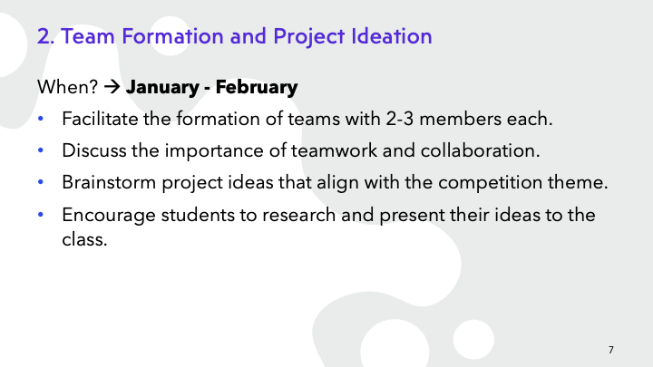

# World Robotics Olympiad - Future Innovator: Training Program Materials

## Links
* [Git Hub](https://github.com/MorokotSakal/wro-fi-kh)
* [Web Page](https://morokotsakal.github.io/wro-fi-kh/)

## Overview
* This repo contains training materials for World Robotics Olympiad - Future Innovators. 
* Target audience: high school student in Cambodia

### Ver 1.0 (2023)
* Training program overview slide created

## Slides
Download slide in PDF. [HERE] (TBA)

